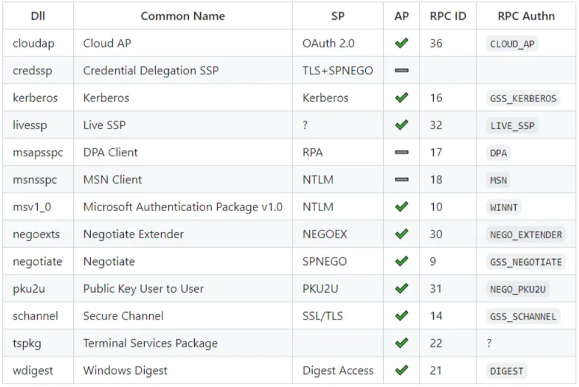
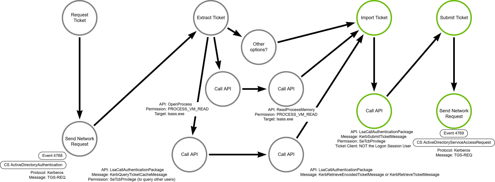

# Pass-the-Ticket

## Metadata

| Key          | Value                                      |
|--------------|--------------------------------------------|
| ID           | TRR0024                                    |
| External IDs | [T1550.003]                                |
| Tactics      | Defense Evasion, Lateral Movement          |
| Platforms    | Windows                                    |
| Contributors | Andrew VanVleet                            |

### Scope Statement

There are many ways for an attacker to acquire Kerberos tickets. While this TRR
will discuss the most common methods used in a pass-the-ticket attack, it is not
the author's intent to make an exhaustive review of all the means by which an
adversary could acquire a valid Kerberos ticket. This TRR will primarily focus
on how an attacker can inject a previously-acquired ticket into their Kerberos
ticket cache, enabling them to assume the identity of the ticket owner.

## Technique Overview

Kerberos is a common authentication protocol supported natively by all modern
operating systems. It is also used extensively for authentication and
authorization in Active Directory domains. As such, it plays a role in many
modern enterprise networks. An attacker who can steal valid Kerberos
tickets from other users can use this procedure to inject those tickets into
their own current logon session and assume the identity of the ticket's
owner.

The Windows operating system has a built-in security package that implements the
Kerberos protocol (found in the library `System32\kerberos.dll`). This security
package supports the ability to add and retrieve tickets from a local cache as a
fundamental part of its Kerberos implementation. Attackers can manipulate this
functionality to acquire and insert tickets belonging to other users.

## Technical Background

The key concepts required to understand this attack are Kerberos tickets and the
Windows implementation of the protocol.

### Kerberos Tickets

Kerberos is a network authentication protocol designed to provide strong
authentication for client/server applications by using symmetric key
cryptography to sign "tickets" that a client can use to prove their identity and
provide authorization to access a network resource.

Kerberos relies on a Key Distribution Center (KDC), comprised of 3 elements.
While these can be distributed over multiple servers, most modern
implementations have them on the same server. These elements are:

- An authentication server (AS) that performs the initial authentication.
- A ticket-granting server (TGS) that issues tickets to clients for specific
  services hosted on APs.
- A Kerberos database that stores the password hash and identity of all verified
users.

The Kerberos protocol defines a series of messages exchanged between the
client, the KDC, and AP. After a client has authenticated, they receive a Ticket
Granting Ticket (TGT) that is stored on the client device and can be used to
request access to specific network resources without having to reauthenticate.
The client presents a TGT to the TGS when it requests access to a network
resource, and the TGS provides a service ticket back to the client. The client
can then provide the service ticket to the AP to gain access to the service.

Kerberos is stateless; it relies on cryptographically signed tickets for
authentication and authorization. This requires that the cryptographic keys are
known only by the key's owner and the KDC. There are a few different keys used
for these cryptographic signatures:

- TGTs are signed with the password hash of the `krbtgt` account, which is a
special service account that represents the KDC in the directory.
- Service tickets are signed with the hash of the service account associated
with a given service (a CIFS share, an FTP server, etc). In the directory,
services are represented by a service principal name (SPN) connected to the
associated service account. The password of the service account should be known
only by the KDC and the service itself.
- Clients prove their identity by signing a timestamp with their own password
hash, which should be known only by the KDC and themselves.

A pass-the-ticket attack abuses the statelessness of the Kerberos protocol. The
possessor of a valid ticket is implicitly accepted as a valid owner of that
identity because the protocol uses cryptography (specifically, session keys and
password hashes that should be known only to the owner) to ensure that tickets
are issued only to their legitimate owners. A pass-the-ticket attack abuses the
mechanisms for storing and retrieving tickets after they have been issued to the
verified owner.

### Windows Local Security Authority (LSA)

The Local Security Authority (LSA) is a protected Windows subsystem that manages
critical security functions like user authentication (validating credentials,
issuing access tokens, etc), enforcement of security policies (like password
complexity requirements and account lockouts), and securely storing secrets
(password hashes, Kerberos tickets, etc). The LSA Subsystem Service (LSASS) is
the process that implements the LSA's functionality; this runs as the trusted
`SYSTEM` account in a process named `lsass.exe.` The LSASS process is a rich
target for attackers, so it has many built-in protections like [Credential
Guard] and [Protected Processes].

#### A Note on Ticket Acquisition

As noted in the scope statement, there are many different ways an attacker could
potentially acquire valid Kerberos tickets that could be used in a
pass-the-ticket attack. The process of reading (or dumping) LSASS process memory
to extract cached Kerberos tickets is functionally equivalent to attack
technique [T1003.001] *OS Credential Dumping: LSASS Memory*. Controls to detect
or prevent T1003.001, like Credential Guard, will also detect or prevent an
attacker from acquiring tickets from LSASS.

Credential Guard makes two important changes to LSASS that are relevant to this
TRR:

1. Credential Guard moves credentials, including cached Kerberos tickets, from
   the `lsass.exe` process into a new isolated process named `lsaiso.exe`. This
   renders procedures that dump credentials directly from LSASS memory
   inoperable.[^1]
2. When Credential Guard is enabled, it is no longer possible to request the
   session key for a cached Kerberos ticket. Without the session key, the
   tickets retrieved from the Kerberos cache can't be used by other
   accounts.[^2]

#### LSA Security Support Providers (SSPs)

LSA provides an extensible architecture for supporting additional security or
authentication protocols through Security Support Providers (SSPs). SSPs are
DLLs loaded by LSA that implement a specific authentication or security
protocol. An SSP can also be an Authentication Package (AP) if it implements an
authentication protocol. The below table (source: [LSA Whisperer - SpecterOps])
provides a summary of the SSPs that have been released by Microsoft over the
years.



#### The Kerberos SSP/AP

Windows' native Kerberos SSP/AP is implemented in `System32/kerberos.dll.`
Generally, programmers do not directly interact with this library because
Windows has provided more user-friendly or generalized interfaces for developers
to use. (For example, Windows has provided [Negotiate SSP], which will
automatically select between Kerberos and NTLM auth depending on the request
circumstances, and the [Security Support Provider Interface] (SSPI) that
provides a common interface regardless of the SSP used.) However, it is possible
to directly invoke Kerberos SSP/AP functionality using the
[LsaCallAuthenticationPackage] API. Here is the function definition:

```code
NTSTATUS LsaCallAuthenticationPackage(
  [in]  HANDLE    LsaHandle,
  [in]  ULONG     AuthenticationPackage,
  [in]  PVOID     ProtocolSubmitBuffer,
  [in]  ULONG     SubmitBufferLength,
  [out] PVOID     *ProtocolReturnBuffer,
  [out] PULONG    ReturnBufferLength,
  [out] PNTSTATUS ProtocolStatus
);
```

The `ProtocolSubmitBuffer` parameter is used to submit a protocol-specific
message to the security package hosted in LSASS. The Kerberos SSP/AP supports
[just short of 40 messages]. The ones relevant to this attack technique are:

- `KerbQueryTicketCacheMessage` - queries the local ticket cache
- `KerbRetrieveEncodedTicketMessage` - retrieves a ticket from the local
  cache
- `KerbSubmitTicketMessage` - submits a ticket to be included in the local cache

> [!NOTE] This list of messages is not necessarily inclusive. It may be possible
> to accomplish the same task with some of the other supported messages.

Most of the Kerberos SSP/AP routines require a calling process to hold the
`SeTcbPrivilege` ('Trusted Computer Base'), which indicates the process is a
trusted part of the operating system. A process running as `SYSTEM` is allowed
to enable this privilege.

### The Kerberos Ticket Cache

Because Kerberos is stateless, it requires a client to hold valid tickets in a
local ticket cache so they can be resubmitted when a client needs to request a
new service ticket or request access to a service. On Windows, this cache is
managed by the LSA. Each logon session has its own ticket cache. Windows comes
with a [klist] utility that allows users to list logon sessions and their
associated tickets. Users can only view their own sessions and tickets, but
accounts holding `Administrator` privileges are permitted to list other user's
sessions and tickets. Accounts holding `SeTcbPrivilege` can extract tickets from
any logon session.

## Procedures

| ID              | Title                          | Tactic            |
|-----------------|--------------------------------|-------------------|
| TRR0024.WIN.A   | Submit ticket to local cache | Defense Evasion, Lateral Movement |

### Procedure A: Submit ticket to local cache

Once a ticket has been stolen, it can be injected into any logon session using
the Kerberos SSP/AP `KerbSubmitTicketMessage` message. This submits the ticket
to be included in the current logon session's ticket cache, where it will be
used whenever access is requested. One important detail to note here: it is
pointless for an attacker to inject a ticket for a user into a logon session for
that same user, because it's a simple matter to request a new valid ticket for
the logged on user. **Thus, maliciously injected tickets will always have a
mismatch between the client the ticket was issued for and the logon session user
account.**

#### Detection Data Model

The DDM includes the ticket acquisition methods used by the popular tools
[Rubeus] and [Mimikatz]. It also acknowledges that there are other ways to
acquire tickets, but this TRR will not attempt an exhaustive exploration of
them. The operations involved in acquiring tickets, in addition to the
operations for the original valid request for the ticket, have been colored gray
in the DDM to indicate that these actions are precursors that must occur before
the ticket can be imported into a new logon session.



## Available Emulation Tests

| ID            | Link             |
|---------------|------------------|
| TRR0024.WIN.A | [Atomic Tests 1-2]          |

## References

- [Security Subsystem Architecture - Microsoft Learn]
- [LSA Whisperer - SpecterOps]
- [LsaCallAuthenticationPackage - Microsoft Learn]
- [Abusing Microsoft Kerberos - BlackHat 2014]
- [Implement Kerberos Auth with LSA Service API]
- [KERB_PROTOCOL_MESSAGE_TYPE enumeration]
- [KERB_RETRIEVE_TKT_REQUEST structure]
- [Get-KerberosTicketGrantingTicket - Jared Atkinson]
- [Rubeus with More Kekeo - SpecterOps]

[^1]: [Credential Guard - Microsoft Learn]
[^2]: [How Credential Guard Works - Steve Syfuhs]

[T1550.003]: https://attack.mitre.org/techniques/T1550/003/
[Credential Guard]: https://learn.microsoft.com/en-us/windows/security/identity-protection/credential-guard/
[Protected Processes]: https://www.crowdstrike.com/en-us/blog/evolution-protected-processes-part-1-pass-hash-mitigations-windows-81/
[Security Subsystem Architecture - Microsoft Learn]: https://learn.microsoft.com/en-us/previous-versions/windows/it-pro/windows-2000-server/cc961760(v=technet.10)
[Negotiate SSP]: https://learn.microsoft.com/en-us/windows/win32/secauthn/microsoft-negotiate
[Security Support Provider Interface]: https://learn.microsoft.com/en-us/previous-versions/dotnet/articles/ms973911(v=msdn.10)#sspi
[LsaCallAuthenticationPackage]: https://learn.microsoft.com/en-us/windows/win32/api/ntsecapi/nf-ntsecapi-lsacallauthenticationpackage
[just short of 40 messages]: https://learn.microsoft.com/en-us/windows/win32/api/ntsecapi/ne-ntsecapi-kerb_protocol_message_type
[T1003.001]: https://attack.mitre.org/techniques/T1003/001/
[Rubeus]: https://github.com/GhostPack/Rubeus/blob/master/Rubeus/lib/LSA.cs#190
[Mimikatz]: https://github.com/gentilkiwi/mimikatz/blob/master/mimikatz/modules/sekurlsa/kuhl_m_sekurlsa.c#L290
[LSA Whisperer - SpecterOps]: https://specterops.io/blog/2024/04/17/lsa-whisperer/
[LsaCallAuthenticationPackage - Microsoft Learn]: https://learn.microsoft.com/en-us/windows/win32/api/ntsecapi/nf-ntsecapi-lsacallauthenticationpackage
[Abusing Microsoft Kerberos - BlackHat 2014]: https://www.slideshare.net/slideshow/abusing-microsoft-kerberos-sorry-you-guys-dont-get-it/37957800#29
[Implement Kerberos Auth with LSA Service API]: https://www.apriorit.com/dev-blog/674-driver-how-to-implement-kerberos-authentication-for-windows-with-the-lsa-service-api
[KERB_PROTOCOL_MESSAGE_TYPE enumeration]: https://learn.microsoft.com/en-us/windows/win32/api/ntsecapi/ne-ntsecapi-kerb_protocol_message_type
[KERB_RETRIEVE_TKT_REQUEST structure]: https://learn.microsoft.com/en-us/windows/win32/api/ntsecapi/ns-ntsecapi-kerb_retrieve_tkt_request
[Atomic Tests 1-2]: https://github.com/redcanaryco/atomic-red-team/blob/master/atomics/T1550.003/T1550.003.md
[klist]: https://learn.microsoft.com/en-us/windows-server/administration/windows-commands/klist
[Get-KerberosTicketGrantingTicket - Jared Atkinson]: https://gist.github.com/jaredcatkinson/c95fd1e4e76a4b9b966861f64782f5a9
[Rubeus with More Kekeo - SpecterOps]: https://specterops.io/blog/2018/10/04/rubeus-now-with-more-kekeo/
[Credential Guard - Microsoft Learn]: https://learn.microsoft.com/en-us/windows/security/identity-protection/credential-guard/how-it-works
[How Credential Guard Works - Steve Syfuhs]: https://syfuhs.net/how-does-remote-credential-guard-work
