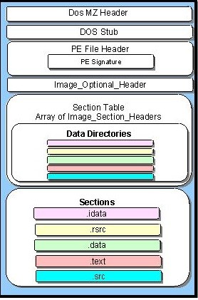
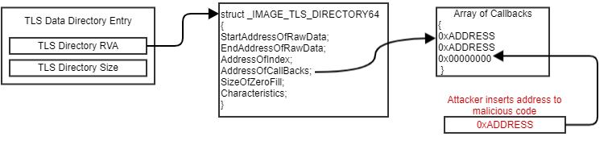
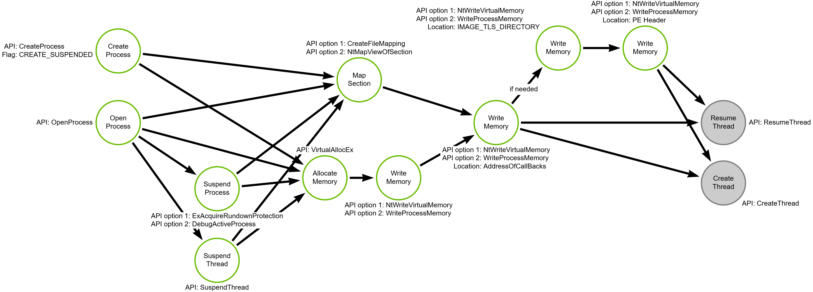

# Process Injection via Thread Local Storage Callback

## Metadata

| Key          | Value                                      |
|--------------|--------------------------------------------|
| ID           | TRR0026                                    |
| External IDs | [T1055.005], [T1055.001], [T1055.002]      |
| Tactics      | Defense Evasion, Privilege Escalation      |
| Platforms    | Windows                                    |
| Contributors | Andrew VanVleet                            |

### Scope Statement

The ATT&CK framework is inconsistent in how it defines sub-techniques for
process injection[^1], resulting in a confusing mapping of TRRs to ATT&CK
techniques. This TRR primarily addresses Process Injection using Thread Local
Storage (TLS) callbacks, which is T1055.005, but this technique can be used to
inject any kind of payload, including PEs and DLLs, so the TRR also covers
aspects of Dynamic-link Library Injection (T1055.001) and Portable Executable
Injection (T1055.002).

## Technique Overview

Adversaries may inject code into other processes in order to evade defenses and
potentially elevate privileges. Running code in another process' context allows
access to that process's memory, resources, and privileges. Using TLS callbacks
for process injection is a less common technique, but has been identified in at
least one malware sample.[^2]

## Technical Background

### Multithreading

As a quick refresher on multithreaded computing, a process must have at least
one thread and can contain many threads running simultaneously. Each processor
has a set of registers and other structures (the translation lookaside buffer
and page table, for example) that are used during execution to store values and
the state of the executing thread. The values held in the registers and other
structures are called the thread's "context." Processes can have multiple
threads running concurrently, and all of the threads share the same virtual
address space, which means they share the same executable code, global and
dynamically-allocated variables, etc.

The operating system scheduler is responsible for scheduling all the threads
currently running on a system to ensure each gets their share of time executing
on one of the system's processors (most modern computers have multiple
processors). The scheduler will designate a thread to run on a given processor,
and after a certain amount of time the thread's execution will be interrupted
and another thread will be scheduled to run. When a change is made from one
thread to another, a "context switch" must happen, where the values of the
interrupted thread's context are saved out and the values from the context of
the next thread are loaded in. Once the context has been switched, the new
thread can resume executing at exactly the spot where it was previously
interrupted. Multithreading allows many threads to share computing resources
while still functioning as though it had a dedicated processor.

### Thread Local Storage

Sometimes it is necessary for threads to have their own unique configuration or
data. Because they share memory with all other threads, they cannot write this
data in shared memory and be certain that it hasn't been modified by other
threads in the process. Thread Local Storage (TLS) is a mechanism that provides
each thread the ability to allocate and access memory that is unique to itself.

This can be done by using the `TlsAlloc` function to request that Windows create
a "TLS index" for the thread. The thread can then place and retrieve values from
the TLS index using `TlsGetValue` and `TlsSetValue`. This feature allows threads
to execute a common set of code but produce unique results depending on the data
stored in their individual TLS index. Windows also provides a method for a
programmer to initialize TLS data before a thread begins executing at its normal
entry point. This permits developers to implement whatever logic is needed to
set the desired value in the TLS storage *before* a thread begins to execute a
function shared with other threads. This capability is provided through *TLS
callbacks*. Whenever a new thread begins executing in a process, the Windows
loader will check to see if there are any TLS callbacks registered. If so it
will set the thread to execute the callbacks first, and then point it to the
entry point code to begin normal execution.

A programmer can define any number of callbacks. They are stored together in an
array (more detail on these arrays follows), and the loader will loop through
the array and call each callback in turn until it reaches the end of the array.
The [PE file format] provides a space in the header for storing the data needed
to implement thread local storage. The TLS directory is one of the directories
in the PE header's Data Directories.

In a 64-bit PE file, there are 15 possible directories:

1. Export
2. Import
3. Resource
4. Exception
5. Security
6. Relocation
7. Debug
8. Architecture
9. Reserved
10. Thread Local Storage (TLS)
11. Load Config
12. Bound Import
13. Import Address Table (IAT)
14. Delay Import
15. CLR (.NET)

Each directory contains information on the size of the directory and the
relative virtual address (RVA) where it can be found. If a particular element
isn't used in the PE file, then the RVA for that directory will be `NULL`.

> [!NOTE]
>
> A relative virtual address (RVA) is the offset from the start of the image
> where an item can be found after the PE has been loaded into memory. In order
> to find the actual virtual address, you add the RVA to the base address where
> the image was loaded.



The TLS directory RVA will point to a structure called the
`IMAGE_TLS_DIRECTORY`, which holds the information about the TLS index,
callbacks, and other details about TLS callbacks. Here is the 64-bit version:

```c++
IMAGE_TLS_DIRECTORY Structure
typedef struct _IMAGE_TLS_DIRECTORY64 {
     ULONGLONG   StartAddressOfRawData;
     ULONGLONG   EndAddressOfRawData;
     PDWORD      AddressOfIndex;
     PIMAGE_TLS_CALLBACK * AddressOfCallBacks;
     DWORD       SizeOfZeroFill;
     DWORD       Characteristics;
 } IMAGE_TLS_DIRECTORY64;
 ```

When the Windows loader creates a process, it stores the address of the TLS
index in the `AddressOfIndex` field of the TLS directory structure. As a result,
this structure must be located in a writable memory section, often the `.data`
or `.rdata` sections. The `AddressOfCallBacks` field is a pointer to an array of
TLS callbacks. The callback array is a series of 8-byte virtual addresses (on a
64-bit system), one after the other, terminated with a `NULL` pointer
(0x00000000). Each address in the array points to a TLS callback function.

### Abusing TLS callbacks

In order to use TLS callbacks for process injection, an attacker must write
their desired code into the target process using any available method. Once the
code is present in the target process, an attacker can add the address for their
code to the array of TLS callbacks, if there is already an array present.



If there is no TLS directory, the attacker must create all of the necessary
structures in the target process's memory and write the RVA to the newly-created
structure into the TLS Data Directory entry in the PE header. After the TLS Data
Directory RVA has been updated, any new threads will execute the malicious code
before they begin executing their intended code.

An attacker can either wait for a new thread or trigger the callback immediately
by creating a new thread in the target process. Since the thread will be
redirected by the attacker's TLS callback and -- having been created by the
attacker -- isn't critical to the process's functioning, the attacker can
specify any starting address at creation, allowing it to potentially avoid
detections that are looking for new threads executing code in suspicious
locations. An attacker could also create a new suspended process, modify the TLS
structures, and then resume it so that the main thread will execute the TLS
callback immediately when the process resumes.

A payload used for TLS injection needs to meet a few requirements:

1. If hijacking legitimate threads, it must complete and return, allowing the
   thread to arrive at its intended entry point. Otherwise, the process might
   become unstable and crash. This can be accomplished by having the initial
   payload code create a new execution thread and then return. This is not
   necessary if using a suspended process or creating a new thread.
2. Once the TLS callback is in place, every new thread in the process will call
   it. In order to avoid having numerous instances of the payload running, the
   code should either remove itself from the TLS Callback array or use a
   synchronization object or other coordination mechanism to ensure only one
   running instance at a time.

## Procedures

| ID                    | Title            | Tactic            |
|-----------------------|------------------|-------------------|
| TRR0026.WIN.A         | Malicious TLS Callback | Defense Evasion, Privilege Escalation    |

### Procedure A: Malicious TLS Callback

The method used to write the payload into the target process does not impact
this technique. Common methods used are allocating memory in the target process
with `VirtualAllocEx` or by mapping in a shared section using
`NtMapViewOfSection`, but any mechanism to get the code into a remote processes'
virtual memory will work.

Operations in gray are optional. An attacker does not have to perform them if
they choose a target process with frequent new threads and an existing array of
TLS callbacks.

#### Detection Data Model



## Available Emulation Tests

| ID            | Link                 |
|---------------|----------------------|
| TRR0026.WIN.A | [TLSInject - GitHub] |

## References

- [PE file format]
- [Thread Local Storage - Manish Kumar]
- [TLS Injection by Ursnif Malware - FireEye]
- [Series on Thread Local Storage - Nynaeve.net]
- [TLSInject - GitHub]

[^1]: [What ATT&CK Gets Wrong About Process Injection - Andrew VanVleet]
[^2]: [TLS Injection by Ursnif Malware - FireEye]

[TLS Injection by Ursnif Malware - FireEye]: https://www.fireeye.com/blog/threat-research/2017/11/ursnif-variant-malicious-tls-callback-technique.html
[Thread Local Storage - Manish Kumar]: https://medium.com/@aragornSec/thread-local-storage-197f9a3f4fe3
[Series on Thread Local Storage - Nynaeve.net]: http://www.nynaeve.net/?p=180
[T1055.001]: https://attack.mitre.org/techniques/T1055/001
[T1055.002]: https://attack.mitre.org/techniques/T1055/002
[T1055.005]: https://attack.mitre.org/techniques/T1055/005
[What ATT&CK Gets Wrong About Process Injection - Andrew VanVleet]: https://medium.com/@vanvleet/ddm-use-case-what-att-ck-gets-wrong-about-process-injection-7c15b6764bfe
[PE file format]: https://learn.microsoft.com/en-us/windows/win32/debug/pe-format
[TLSInject - GitHub]: https://github.com/vanvleeta/TLSInject
