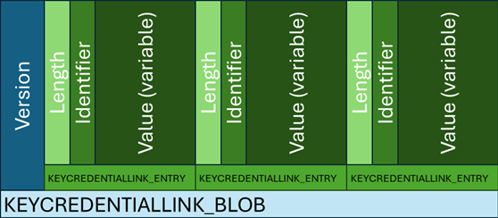
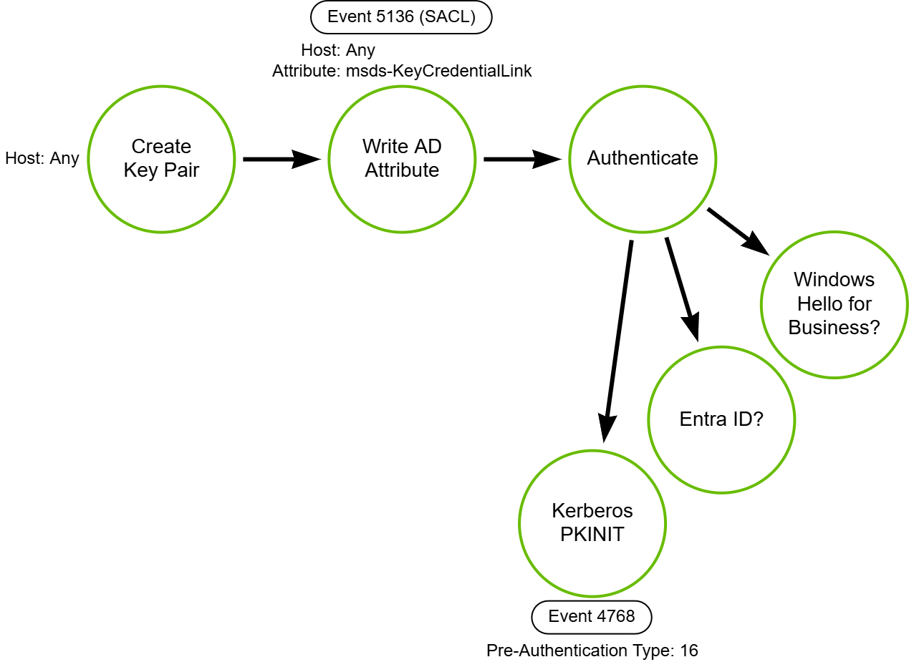

# Key Credential Link Addition (Shadow Credentials)

## Metadata

| Key          | Value                                      |
|--------------|--------------------------------------------|
| ID           | TRR0028                                    |
| External IDs | [T1098.001], [T1098]                       |
| Tactics      | Persistence, Privilege Escalation          |
| Platforms    | Active Directory                           |
| Contributors | Andrew VanVleet, Chris Hodson              |

### Scope Statement

This technique involves manipulating the `msds-KeyCredentialLink` attribute in
Active Directory, which plays a role in multiple certificate-based
authentications schemas. It can be used to authenticate to Entra ID or Active
Directory (via Kerberos PKINIT). The technique has not been included in the
ATT&CK framework, but maps mostly closely to T1098.001 Additional Cloud
Credentials and T1098 Account Manipulation.

## Technique Overview

An attacker with access to an account that has permission to modify the
`msds-KeyCredentialLink` attribute in Active Directory can insert an
authentication certificate, which allows them to authenticate as the modified
user or computer even if the account password is changed. Access to write to
this attribute should be limited to highly privileged domain accounts.

## Technical Background

### Public Key Infrastructure (PKI)

Public Key Infrastructure (PKI) is a framework of technologies, policies, and
procedures that uses cryptographically-signed digital certificates to allow
entities to authenticate with one another and securely exchange information. PKI
relies on asymmetric cryptography, which uses a pair of keys: a public key that
can be shared openly and a private key that is known only by the owner.

At the core of PKI is the concept of **digital certificates**, which are issued
by trusted entities called **Certificate Authorities (CAs)**. A digital
certificate binds a public key to an entity (such as a person, organization, or
device) and includes identifying information like the entity's name and the
certificate's validity period. These certificates follow the `X.509` standard
and are commonly referred to as `X.509 certificates`. The PKI process typically
involves several components: the CA, a Registration Authority (RA) that verifies
identities before certificates are issued, and a Certificate Repository where
certificates and revocation lists are stored. Certificates can be obtained from
a public CA or organizations can implement their own CA.

When one party is attempting to validate the identity of another via PKI, the
second party presents its certificate to the first. The first party verifies
that the certificate was signed by a trusted CA (using the CA's public key to
validate the signature) and that the certificate hasn't expired or been revoked.
If everything checks out, the first party accepts the identity of the second
party. If information needs to be exchanged (like browsing a secure website),
both parties will exchange keys to establish an encrypted session.

### Key Credential Links

Key Credential Links are a mechanism to link a public/private key pair to an
identity (user or device) in Active Directory. Microsoft created the
`msds-KeyCredentialLink` attribute in AD to store certificates or public keys
and the matching certificate for each entry should be found in the certificate
store on the computer with the matching DeviceID. The attribute supports
multiple technologies, including Windows Hello for Business, file encryption,
and FIDO passwordless authentication (like smart cards). User objects can't edit
their own `msDS-KeyCredentialLink` attribute, but computer objects can add a
KeyCredential if one doesn't already exist.

The `msds-KeyCredentialLink` attribute is a multi-value field, with each entry
holding one public key. Each entry is an [Object(DN-Binary)] structure, meaning
it has a binary value and a distinguished name (DN). The distinguished name is
what links the key to an identity in AD, while the binary value holds the actual
credential. The format is:

`B:<char count>:<binary value in hex>:<object DN>`

The binary portion is a [KEYCREDENTIALLINK_BLOB] structure, which holds a
variable-length array of [KEYCREDENTIALLINK_ENTRY] structures, sorted by the
identifier value in ascending order. The `KEYCREDENTIALLINK_ENTRY` structures
are triplets (length, identifier, value) that collectively hold the elements of
the credential, including the key ID, hash, source (currently AD or Entra),
device ID, creation time, and the key material itself.

The `msds-KeyCredentialLink` attribute currently supports three types of key
material: Next Gen Credentials (NGC - for WHfB), FIDO passwordless keys, and
file encryption keys.[^1]

### Logging

If Active Directory has been configured to audit [service changes], a System
Access Control List (SACL) can be configured to audit changes to the
`msds-KeyCredentialLink` attribute, which will generate [event 5136] when the
attribute is modified on an object. The log does not include the binary
information from the attribute, but it does include the length, the account that
made the change, and the account where the attribute was modified.

## Procedures

| ID             | Title                        | Tactic            |
|----------------|------------------------------|-------------------|
| TRR0028.AD.A   | Key Credential Link Addition | Persistence, Privilege Escalation |

### Procedure A: Key Credential Link Addition

If an adversary can gain control of an account with permissions to edit the
`msDs-KeyCredentialLink` attribute, they can insert their own credential and use
it to authenticate as that identity. The credential will be valid so long as the
key exists and the certificate remains valid, allowing persistence through
password resets. By default, permissions to edit this attribute are reserved to
highly-privileged domain accounts, but misconfigurations are possible given the
opacity around the attribute and how it could be abused. `AllExtendedRights`,
`GenericAll`, `GenericWrite` or `WriteAccountRestrictions` permissions over an
AD user or computer object would enable an adversary to write in a new Key
Credential Link and assume that object's identity. Alternately, administrative
privileges on a computer in the domain allows an adversary to add an entry for
the computer's machine account if one doesn't already exist.

The script [Parse-KCLEntries.ps1] enumerates user accounts in AD that have an
`msds-KeyCredentialLink` attribute and parses each entry. You can enumerate
computer objects by changing `Get-ADUser` to `Get-ADComputer`, but expect many
results. The script can be used to look for unusual credentials in the domain.

> [!NOTE]
>
> This procedure can be used to acquire a TGT via PKINIT, which is the first
> step in an [UnPAC-the-Hash] attack.

#### Detection Data Model

The DDM includes the known mechanism for using a shadow credential to get a
Kerberos TGT, but it might also be possible to access one of the Microsoft
platforms that use authentication supported by the `msds-KeyCredentialLink`
attribute. This is an area where further attack research could be done, but
falls outside the scope of this TRR.

## Available Emulation Tests

| ID            | Link             |
|---------------|------------------|
| TRR0028.AD.A  |                  |

## References

- [Shadow Credentials - Elad Shamir]
- [Whisker - GitHub.com]
- [Exploiting Windows Hello for Business - BlackHat]
- [Parse msds-KeyCredentialLink Attribute Value - Microsoft Learn]
- [DACL Misconfiguration and Shadow Credentials - i-tracing.com]

[^1]: [KEYCREDENTIALLINK_ENTRY Identifiers]

[event 5136]: https://learn.microsoft.com/en-us/previous-versions/windows/it-pro/windows-10/security/threat-protection/auditing/event-5136
[service changes]: https://learn.microsoft.com/en-us/previous-versions/windows/it-pro/windows-10/security/threat-protection/auditing/audit-directory-service-changes
[T1098.001]: https://attack.mitre.org/techniques/T1098/001
[T1098]: https://attack.mitre.org/techniques/T1098/
[Shadow Credentials - Elad Shamir]: https://eladshamir.com/2021/06/21/Shadow-Credentials.html
[DACL Misconfiguration and Shadow Credentials - i-tracing.com]: https://i-tracing.com/blog/dacl-shadow-credentials/
[Whisker - GitHub.com]: https://github.com/eladshamir/Whisker
[Exploiting Windows Hello for Business - BlackHat]: https://www.youtube.com/watch?v=u22XC01ewn0
[Parse msds-KeyCredentialLink Attribute Value - Microsoft Learn]: https://learn.microsoft.com/en-us/troubleshoot/windows-server/support-tools/script-to-view-msds-keycredentiallink-attribute-value
[Object(DN-Binary)]: https://learn.microsoft.com/en-us/windows/win32/adschema/s-object-dn-binary
[KEYCREDENTIALLINK_BLOB]: https://learn.microsoft.com/en-us/openspecs/windows_protocols/ms-adts/f3f01e95-6d0c-4fe6-8b43-d585167658fa
[KEYCREDENTIALLINK_ENTRY]: https://learn.microsoft.com/en-us/openspecs/windows_protocols/ms-adts/7dd677bd-9315-403c-8104-b6270350139e
[KEYCREDENTIALLINK_ENTRY Identifiers]: https://learn.microsoft.com/en-us/openspecs/windows_protocols/ms-adts/a99409ea-4982-4f72-b7ef-8596013a36c7
[UnPAC-the-Hash]: https://github.com/tired-labs/techniques/blob/main/reports/trr0029/win/README.md
[Parse-KCLEntries.ps1]: ./parse-kclentries.ps1
