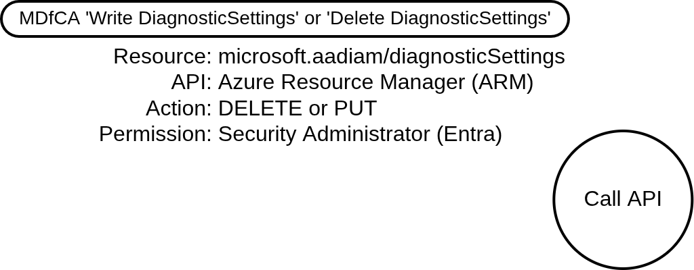
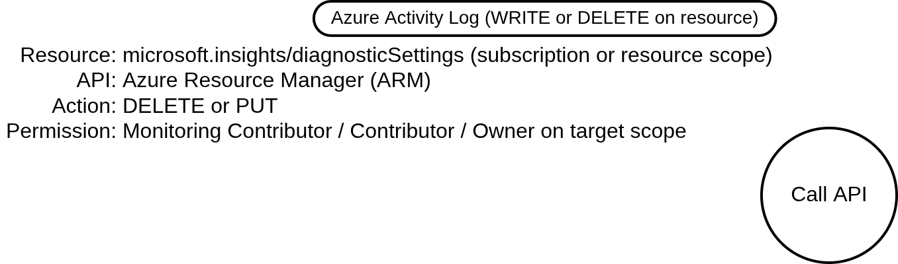

# Disable or Modify Cloud Logs (Azure)

## Metadata

| Key          | Value              |
|--------------|--------------------|
| ID           | TRR0033            |
| External IDs | [T1685.002]        |
| Tactics      | Defense Impairment |
| Platforms    | Azure              |
| Contributors | Andrew VanVleet    |

### Scope Statement

This TRR covers techniques to disable or modify cloud logs in the Azure and
Entra ID platforms by tampering with the log export pipeline.

The TRR does not include logging for Microsoft 365; that is covered in
[TRR0033.M365]. The TRR also does not address efforts to remove logs from the
logging destinations themselves (deleting a Log Analytics workspace, altering
workspace retention, deleting stored data, etc). These are destination-side
actions rather than modifications to the cloud logging configuration.

## Technique Overview

Cloud platforms record administrative and authentication activity in logs, often
providing the only forensic and investigative resource for defenders to
understand events that occurred in their cloud tenants. By disabling or
modifying these logs, an attacker reduces the record of their activity, delaying
or preventing detection and complicating any subsequent investigation.

In Azure (and its integrated identity provider, Entra ID), the platform
generates activity logs automatically and makes them available short-term,
usually via the Azure portal, an API endpoint, or both. These short-term logs
cannot be edited or deleted, but attackers can target the **export pipeline**
that copies log records to long-term storage and detection platforms, such as a
SIEM. Severing this pipeline leaves recent records available only in the
short-term store (which ages out after 7 to 90 days depending on the source) and
can stop new records from reaching the defender's analysis and alerting
platforms.

An attacker who can modify a diagnostic setting has two options: they can delete
the diagnostic setting entirely or they can edit it to reduce the logging scope
(for example, removing sign-in logs while leaving other categories in place to
avoid an obvious gap). Both achieve the same effect of blinding the defender to
some or all future activity, and both are addressed in this TRR.

A notable property of this technique in Azure is that it cannot erase evidence
of *itself*: the action of modifying a diagnostic setting is generally recorded
in a log the attacker has not yet blinded (or in an out-of-band stream), so a
defender with an export destination configured before the attack retains a
record of the disabling action. The one significant exception to this is the
Entra diagnostic setting, which is discussed in detail below and represents an
important observability gap.

## Technical Background

### Azure's Three-Layer Logging Model

Logging in Azure and Entra ID follows a three-layer model. Understanding which
layer a technique targets is essential to understanding both its effect and its
observability.

1. **Source generation.** Events are emitted by the platform's control plane:
   the Entra directory, the Azure Resource Manager (ARM), the specfic resource,
   etc. On these platforms, source generation is system-controlled and cannot be
   disabled by an administrator. Microsoft's documentation states explicitly
   that Entra audit log entries "are system generated and can't be changed or
   deleted."[^1]

2. **In-portal retention.** A short-term store viewable in the Azure and Entra
   admin portals. This store has a fixed, relatively short retention window and
   cannot be extended in place; extending retention requires exporting to an
   external destination. Default windows are 7 days (Entra Free license) or 30
   days (Entra ID P1/P2) for Entra activity logs, and 90 days for the Azure
   Activity Log. Not every log has this layer: Microsoft Graph activity logs and
   Azure resource logs have no in-portal store and exist only at an export
   destination.

3. **Export pipeline.** An explicit configuration via a **diagnostic setting**
   that copies log records to a long-term destination: a Log Analytics
   workspace, a storage account, an event hub, or a partner solution.

### Azure Log Sources

Azure's log sources can generally be organized along two axes: the **component**
that generates the log (Entra or ARM) and the **plane** of activity it records
(control or data). The control plane records configuration changes; the data
plane records the service performing its function. Each log usually maps to one
component and one plane.

| Log Type | Component | Plane | Short-term Store | Access API | Config Interface |
| --- | --- | --- | --- | --- | --- |
| **Entra Audit Logs** | Entra | Control | Entra → Monitoring → Audit | Graph ``/auditLogs/directoryAudits`` | ARM ``microsoft.aadiam`` object |
| **Entra Sign‑in Logs** | Entra | Data | Entra → Monitoring → Sign‑ins | Graph ``/auditLogs/signIns`` | ARM ``microsoft.aadiam`` object |
| **Graph Activity Logs** | Entra | Both | None | Per diagnostic setting | ARM ``microsoft.aadiam`` object |
| **Azure Activity Log** | ARM | Control | Azure Monitor → Activity Log | Azure Monitor REST / ``Get‑AzLog`` | ARM ``microsoft.insights`` object (per subscription) |
| **Azure Resource Logs** | ARM | Data | None | Per diagnostic setting | ARM ``microsoft.insights`` object (per resource) |

#### Diagnostic Settings as an ARM Resource

A diagnostic setting is itself an ARM resource, modified through the standard
ARM REST API at `management.azure.com`. The same operation can be performed
through Azure PowerShell (`Set/Remove-AzDiagnosticSetting`), the Azure CLI (`az
monitor diagnostic-settings`), Terraform, Bicep, the Azure portal, etc; all of
these funnel through the same ARM endpoint.

The resource path differs by scope:

| Scope | ARM resource path |
| --- | --- |
| Entra tenant | `/providers/microsoft.aadiam/diagnosticSettings/{name}` |
| Subscription | `/subscriptions/{sub}/providers/microsoft.insights/diagnosticSettings/{name}` |
| Resource | `/{resourceId}/providers/microsoft.insights/diagnosticSettings/{name}` |

Two operations against this resource produce the desired effect for this
technique. A `DELETE` removes the setting entirely, stopping all export. A `PUT`
(recorded as `WRITE` in the telemetry) can be used to overwrite the setting with
a modified configuration — for example, removing one or more log categories or
pointing the export at a destination the attacker controls.

An important aspect is that Entra diagnostic settings, which govern the export
of both Entra audit and sign-in logs, are configured through ARM. But Entra is a
*tenant-scoped* resource rather than subscription-scoped, so modifications to
the resource are not recorded in the per-subscription ARM activity logs, and
changes are also not recorded in the Entra audit logs (though it is unclear
why). This is an unusual situation in which the control plane that performs the
action does not emit a log recording it.

#### Entra ID Audit Logs (Entra component, control plane)

Entra audit logs record changes to the directory's configuration: applications,
groups, users, licenses, role assignments, Conditional Access policies, and
B2B/B2C activity. Records are system-generated and immutable. They are accessed
through Microsoft Graph at `/auditLogs/directoryAudits` and are exported via a
tenant-scoped diagnostic setting using the `AuditLogs` category. The in-portal
store holds 7 days (Free) or 30 days (P1/P2). Creating or editing the diagnostic
setting requires the Security Administrator role.

#### Entra ID Sign-in Logs (Entra component, data plane)

Sign-in logs record authentication events: interactive and non-interactive user
sign-ins, service principal sign-ins, and managed identity sign-ins. Each record
includes the IP address, location, application, Conditional Access evaluation,
and MFA status. This is the identity service performing its core function, hence
it can be classified as the data-plane log for Entra ID. Sign-in logs are
accessed through Microsoft Graph at `/auditLogs/signIns` and exported via the
same tenant-scoped diagnostic setting as audit logs, using categories such as
`SignInLogs`, `NonInteractiveUserSignInLogs`, `ServicePrincipalSignInLogs`, and
`ManagedIdentitySignInLogs`. Export requires Entra ID P1 or higher. In-portal
retention matches the audit logs (7 to 30 days).

#### Microsoft Graph Activity Logs (Entra component, both planes)

Microsoft Graph activity logs are an audit trail of the HTTP requests that the
Microsoft Graph service (`graph.microsoft.com`) receives for a tenant. Unlike
the audit and sign-in logs, which record outcomes (a directory object changed, a
principal authenticated), this log records the API requests themselves: the
calling application, HTTP method, request URI, caller IP, and response status.
Because the requests it captures span both reads and configuration-changing
writes, its content crosses both planes; in character it is a
request/transport-layer log of the Graph API gateway rather than a change or
authentication log. A single control-plane change therefore appears from two
angles — this log records that the Graph call was made, while the Entra audit
log records the resulting directory change.

The log is configured through the same tenant-scoped `microsoft.aadiam`
diagnostic setting as the audit and sign-in logs, using the
`MicrosoftGraphActivityLogs` category, and likewise requires Entra ID P1 or P2
and the Security Administrator role. It has no in-portal store; it is only
available at the diagnostic-setting destination.

> [!NOTE]
>
> This log captures only `graph.microsoft.com` traffic and does not record
> requests to the legacy Azure AD Graph endpoint at `graph.windows.net`. A
> separate log category, `AzureADGraphActivityLogs`, covers the legacy endpoint,
> but the legacy Azure AD Graph API reached full retirement on August 31, 2025,
> so there should be no new activity for that log to record.

#### Azure Activity Log (ARM component, control plane)

The Azure Activity Log records subscription-level control-plane events: every
ARM operation against a resource (create, modify, delete), role assignments, and
policy assignments. It answers the question "who did what to which Azure
resource." It is accessed through the Azure Monitor REST API or `Get-AzLog`
cmdlet and is exported via a subscription-scoped diagnostic setting using
categories such as `Administrative`, `Security`, and `Policy`. The in-portal
store holds 90 days. Modifying the diagnostic setting requires the Monitoring
Contributor role (or Contributor/Owner) on the subscription.

#### Azure Resource Logs (ARM component, data plane)

Resource logs record resource-specific data-plane events: Key Vault secret
access, storage account blob read/write/delete operations, network security
group flow logs, SQL audit events, and so on. These are emitted by the resource
itself and are not present in the Activity Log. They have no default persistent
store; if a diagnostic setting is not configured, the logs are not retained
anywhere accessible. They are exported via a resource-scoped diagnostic setting
(the same `microsoft.insights/diagnosticSettings` resource type, attached to
the target resource), and each resource type defines its own available log
categories. Modifying the diagnostic setting requires write permission on the
parent resource plus the Monitoring Contributor role.

## Procedures

| ID            | Title                            | Tactic          |
|---------------|----------------------------------|-----------------|
| TRR0033.AZR.A | Modify Entra Diagnostic Setting  | Defense Impairment |
| TRR0033.AZR.B | Modify Azure Diagnostic Setting  | Defense Impairment |

### Procedure A: Modify Entra Diagnostic Setting

An attacker holding the Security Administrator role (or another role with
permission to write Entra diagnostic settings) modifies the tenant's
`microsoft.aadiam` diagnostic setting to stop the export of Entra audit and
sign-in logs to their long-term store. The attacker can either delete or modify
the setting.

#### Detection Data Model

The procedure consists of a single essential operation: modifying the
tenant-scoped `microsoft.aadiam` diagnostic settings resource through ARM, via
either a `PUT` (to reduce categories or redirect the destination) or a `DELETE`
(to remove the setting).

The only known telemetry source is via Microsoft Defender for Cloud Apps
(MDfCA), where the `ActionType` will be `Write DiagnosticSettings` or `Delete
DiagnosticSettings`.

### Procedure B: Modify Azure Diagnostic Setting

An attacker holding the Monitoring Contributor role (or Contributor/Owner) on a
subscription or resource modifies the corresponding `microsoft.insights`
diagnostic setting to stop the export of the Azure Activity Log (at subscription
scope) or of resource logs (at resource scope). As in Procedure A, the attacker
can delete the setting or overwrite it to remove specific categories.

#### Detection Data Model

The procedure consists of a single essential operation: modifying a
`microsoft.insights` diagnostic settings resource through ARM at subscription or
resource scope, via either a `PUT` or a `DELETE`.

The operation is recorded in the Azure Activity Log under the `Administrative`
category, with the operation name `MICROSOFT.INSIGHTS/DIAGNOSTICSETTINGS/WRITE`
for a category-reducing edit or `MICROSOFT.INSIGHTS/DIAGNOSTICSETTINGS/DELETE`
for a full removal. Because this record is generated at the moment of the
change, the log recording the modification will be generated before the change
takes effect, ensuring that a defender exporting the Activity Log to an external
destination prior to the attack still receives a record of the action.

## Available Emulation Tests

| ID            | Link |
|---------------|------|
| TRR0033.AZR.A |      |
| TRR0033.AZR.B |      |

## References

- [Disable or Modify Cloud Logs - MITRE ATT&CK][T1685.002]
- [Configure Microsoft Entra diagnostic settings - Microsoft Learn]
- [Logs available for streaming from Microsoft Entra ID - Microsoft Learn]
- [Learn about the audit logs in Microsoft Entra ID - Microsoft Learn]
- [Subscription Diagnostic Settings Delete - Azure Monitor REST API]
- [microsoft.aadiam/diagnosticSettings - ARM template reference]
- [Azure Activity Log event schema - Microsoft Learn]
- [Auditing Azure AD Diagnostics Setting Changes - Sam's Corner]
- [Detect Azure AD Diagnostics Setting Changes - Sam's Corner]

[^1]: [Learn about the audit logs in Microsoft Entra ID - Microsoft Learn]

[T1685.002]: https://attack.mitre.org/techniques/T1685/002/
[TRR0033.M365]: ../m365/README.md
[Configure Microsoft Entra diagnostic settings - Microsoft Learn]: https://learn.microsoft.com/en-us/entra/identity/monitoring-health/howto-configure-diagnostic-settings
[Logs available for streaming from Microsoft Entra ID - Microsoft Learn]: https://learn.microsoft.com/en-us/entra/identity/monitoring-health/concept-diagnostic-settings-logs-options
[Learn about the audit logs in Microsoft Entra ID - Microsoft Learn]: https://learn.microsoft.com/en-us/entra/identity/monitoring-health/concept-audit-logs
[Subscription Diagnostic Settings Delete - Azure Monitor REST API]: https://learn.microsoft.com/en-us/rest/api/monitor/subscription-diagnostic-settings/delete
[microsoft.aadiam/diagnosticSettings - ARM template reference]: https://learn.microsoft.com/en-us/azure/templates/microsoft.aadiam/2017-04-01/diagnosticsettings
[Azure Activity Log event schema - Microsoft Learn]: https://learn.microsoft.com/en-us/azure/azure-monitor/platform/activity-log-schema
[Auditing Azure AD Diagnostics Setting Changes - Sam's Corner]: https://samilamppu.com/2021/04/19/auditing-azure-ad-diagnostics-setting-changes/
[Detect Azure AD Diagnostics Setting Changes - Sam's Corner]: https://samilamppu.com/2022/05/30/detect-azure-ad-diagnostics-setting-changes-in-microsoft-sentinel/
