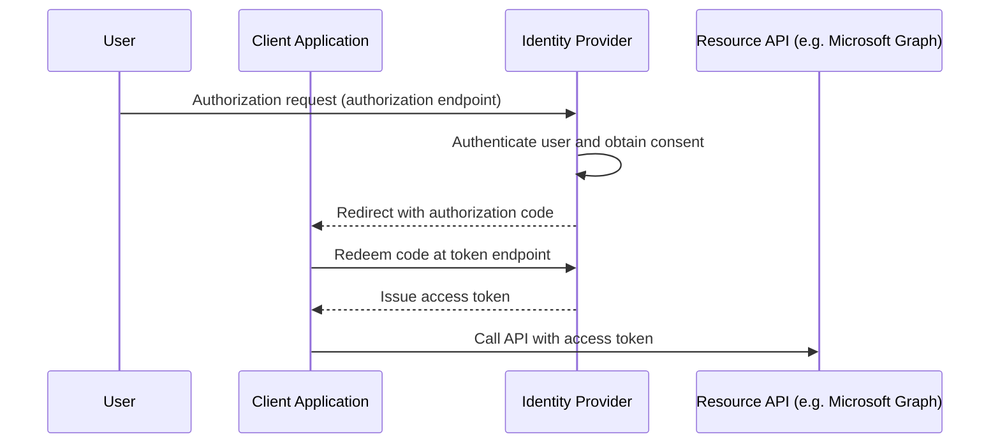

# OAuth Authorization Code Phishing

## Metadata

| Key          | Value             |
| ------------ | ----------------- |
| ID           | TRR0034           |
| External IDs | [T1528]           |
| Tactics      | Credential Access |
| Platforms    | Azure             |
| Contributors | Kyle Barboza      |

## Technique Overview

OAuth authorization code phishing is a technique where an attacker abuses the
OAuth authorization code flow to obtain authorization codes generated during a
legitimate authentication process. In Microsoft Entra ID environments, an
attacker can craft a malicious authorization request and distribute it through
phishing or social engineering to convince a victim to initiate the OAuth
authentication flow.

After the victim successfully authenticates and grants consent, the identity
provider issues an authorization code and redirects the user's browser to the
specified redirect URI. If the attacker obtains this authorization code before
it is redeemed by the intended client application, they can exchange it at the
token endpoint to obtain an access token representing the victim's identity,
allowing access to APIs and services such as Microsoft Graph or Azure Resource
Manager depending on the granted permissions.

This TRR does not cover a situation where an attacker is able to gain control
over a subdomain for a legitimate registered reply URL for a Microsoft
first-party application. In that situation, the attacker could provide the
malicious subdomain as the reply URL in the authorization request and the
authorization code would be sent directly to them. This TRR will not address
this possibility because responsibility for securing first-party applications,
including their reply URLs, is held by Microsoft and out of the control of
individual tenant owners.

This technique is related to but distinct from the illicit consent grant
technique (Microsoft's "Malicious Application Consent," AZT203). Illicit consent
grant relies on the victim approving a malicious application and granting it
permissions. This technique does not depend on that approval step. Instead, it
abuses the OAuth authorization code flow directly, often leveraging trusted
first-party applications, to capture an authorization code after the victim
authenticates.

## Technical Background

### OAuth

OAuth is a foundational protocol used by modern identity platforms to enable
**secure authorization between users and applications**. It allows a user to
grant an application limited access to resources without sharing credentials
directly with the application.

Instead of providing a password directly to the application, a separate
identity provider authenticates the user and issues **tokens that represent the
user’s authorized permissions**. These tokens can then be used by the
application to access APIs on behalf of the user.

In Microsoft Entra ID environments, OAuth is commonly used to authorize
applications to access services such as:

- Microsoft Graph
- Azure Resource Manager
- Exchange Online
- SharePoint

This model allows applications to access resources while authentication and
authorization decisions remain centralized within the identity provider.

### OAuth Authorization Code Flow

One of the most common OAuth implementations is the **Authorization Code Flow**.
This flow is designed for applications that can securely perform server-side
communication with the identity provider.

In this model, the client application redirects the user to the identity
provider for authentication. After the user successfully authenticates and
grants consent, the identity provider issues a temporary **authorization code**.
The client application then exchanges this code for an **access token**.



The authorization code is designed to be **short-lived** and is intended to be
redeemed only by the client application that initiated the request.

### Authorization Endpoint

The authorization flow begins when the client application directs the user's
browser to the identity provider’s **authorization endpoint**.

In Microsoft Entra ID, this endpoint typically appears as:

```
https://login.microsoftonline.com/{tenant}/oauth2/v2.0/authorize
```

The authorization request contains several parameters that define the request:

- `client_id` – identifies the requesting application
- `redirect_uri` – the location where the authorization code will be sent
- `response_type` – specifies the requested OAuth response (such as `code`)
- `scope` – defines the permissions being requested
- `state` – a client-provided value used to maintain request integrity

An example authorization request may appear as follows:

```
https://login.microsoftonline.com/common/oauth2/v2.0/authorize
?client_id=9bc3ab49-b65d-410a-85ad-de819febfddc
&response_type=code
&redirect_uri=http://localhost:3000/
&response_mode=query
&scope=https://microsoft.sharepoint.com/.default
&state=12345
```

After the user authenticates and grants consent, the identity provider
redirects the browser to the specified `redirect_uri`, including the
authorization code as a parameter.

### Redirect URI Behavior

The **redirect URI** defines where the authorization server sends the
authorization code after authentication.

The authorization code is delivered through a browser redirect and typically
appears in the query parameters of the redirected URL.

Example:

```
https://application.example.com/callback?code=AUTHORIZATION_CODE
```

The client application is expected to receive this authorization code and
immediately exchange it with the identity provider's token endpoint.

In some cases, redirect URIs may reference local addresses such as:

```
http://localhost:3000/
```

When the redirect URI points to a local host that is not actively running the
client application, the OAuth authorization flow cannot complete normally.
However, the identity provider may still generate the authorization code and
include it in the redirected URL.

This behavior can expose the authorization code within the browser session prior
to it being redeemed by a client application.

Microsoft Entra ID validates the `redirect_uri` parameter against the reply
URLs registered for the application identified by `client_id`. If the value does
not match a registered reply URL, the authorization request fails with a
redirect URI mismatch error. For the ConsentFix procedure, the attacker is not
adding a new reply URL or registering a new application. They are selecting a
valid reply URL already present on a Microsoft first-party application, such as
a `localhost` reply URL used by command-line or development-oriented clients.

> [!NOTE]
>
> You can list applications in your tenant that have a `localhost` reply URL
> registered with the following PowerShell script:
>
> ```powershell
> Connect-MgGraph -scope "Directory.Read.All"
> Get-MgServicePrincipal -All | Where-Object {
>     $_.ReplyUrls -like "*localhost*"
> }
> ```

This validation is important for procedure scoping. A non-localhost reply URL
would only support direct attacker collection if the first-party application has
a registered reply URL that can deliver the code to attacker-controlled
infrastructure, such as through an exploitable open redirect or overly broad
reply URL pattern. The public ConsentFix research reviewed for this TRR
describes valid `localhost` reply URLs and some first-party owned web reply
URLs, but does not document an attacker-controlled reply URL for the selected
first-party application.

### Token Exchange

Once the client receives the authorization code, it sends a request to the
identity provider's **token endpoint** to exchange the code for an access token.

In Microsoft Entra ID, the token endpoint typically appears as:

```
https://login.microsoftonline.com/{tenant}/oauth2/v2.0/token
```

If the request is valid, the identity provider issues an **access token**
representing the authenticated user and the permissions granted during the
authorization request.

The client application can then use this token to access APIs such as Microsoft
Graph.

### First-Party Applications

Microsoft Entra ID includes a number of first-party applications, which are
applications developed and maintained by Microsoft.

These applications are often represented in customer tenants by service
principals that Microsoft provisions automatically or on first use. The service
principal is the tenant-local object for the globally defined Microsoft
application. Delegated permission grants for that service principal are stored
as `OAuth2PermissionGrant` objects. When those grants already exist for the
requested resource and scope, Entra ID does not show the user a new consent
prompt because consent has already been granted in the tenant.

These grants are enumerable through Microsoft Graph by an authenticated
principal with directory read access. Listing `servicePrincipals` (filtered by
`publisherName eq 'Microsoft'`) reveals first-party applications and their
defined scopes, while `oauth2PermissionGrants` reveals which delegated consent
grants already exist in the tenant. Reading these requires `Directory.Read.All`
(or `Application.Read.All` for service principals) and, for delegated calls, a
directory role such as Directory Readers or Global Reader. An attacker who
already has such read access can use this to identify the first-party
`client_id` values most likely to avoid a consent prompt. Many Microsoft
first-party `client_id` values are also publicly documented, so this step is not
strictly required to select a target application.

In the context of this technique, first-party applications play a critical role
by removing the need for a traditional consent prompt. The attacker is not
registering a new application. Instead, they craft an authorization request that
uses the globally consistent `client_id` of an existing Microsoft application.
Because the corresponding service principal and delegated permission grant may
already exist in the victim tenant, the victim may see only a Microsoft sign-in
or account selection prompt rather than a suspicious consent screen.

The example authorization request in this TRR uses
`9bc3ab49-b65d-410a-85ad-de819febfddc`, the application ID for Microsoft
SharePoint Online Management Shell. This application has delegated scopes such
as `AllProfiles.Manage`, `Sites.FullControl.All`, and `User.Read.All`, with the
reply URL `https://oauth.spops.microsoft.com/`. Those grants make the
application useful when the attacker wants SharePoint or user profile access
without registering a new application or triggering a new consent prompt.

Other commonly discussed first-party applications include Microsoft Azure CLI,
Microsoft Azure PowerShell, Visual Studio, Visual Studio Code, Microsoft Teams,
and Aadrm Admin Powershell. These applications are attractive targets because
they are Microsoft first-party applications with existing consent grants in many
tenants, allowing authorization requests to avoid the suspicious consent prompt
associated with newly registered third-party applications. The practical impact
depends on which delegated scopes are already granted for the selected
application and whether the application's registered reply URLs allow the
authorization code to be exposed or captured.

For many ConsentFix examples, that useful reply URL is `localhost`. Local
redirect URIs are common for public clients and developer tools because a
locally running application can receive the code through a loopback listener.
In the attack, no legitimate local listener is present. Entra ID can still issue
the code because the reply URL is registered for the first-party application,
but the browser displays the failed local navigation to the victim with the code
visible in the address bar.

Tenant controls can affect whether this technique succeeds. Administrators can
scope access to some first-party applications by creating the corresponding
enterprise application object and requiring user assignment, reducing which
users can authenticate to those apps. Conditional Access can also limit token
issuance for the targeted application based on device, location, risk, or other
policy conditions, although the attacker may still benefit from the victim's
successful interactive authentication. Detection engineers should therefore
inventory first-party service principals, review delegated permission grants,
and examine which reply URLs and resources appear in sign-in activity for those
applications.

## Procedures

| ID            | Title      | Tactic            |
| ------------- | ---------- | ----------------- |
| TRR0034.AZR.A | Authorization Code Collection via Social Engineering (ConsentFix) | Credential Access |

### Procedure A: Authorization Code Collection (ConsentFix)

In this procedure, the attacker abuses the OAuth authorization code flow by
manipulating the authorization request and redirect behavior in order to obtain
the authorization code generated during the authentication process.

The attacker crafts an OAuth authorization request directed at the Microsoft
identity platform authorization endpoint. This request contains parameters
defining the client application, requested scopes, and the redirect URI where
the authorization code will be returned.

Example authorization request:

```
https://login.microsoftonline.com/common/oauth2/v2.0/authorize
?client_id=9bc3ab49-b65d-410a-85ad-de819febfddc
&response_type=code
&redirect_uri=http://localhost:3000/
&response_mode=query
&scope=https://microsoft.sharepoint.com/.default
&state=12345
```

The attacker then delivers this request to the victim through a phishing page or
other social engineering technique designed to encourage the victim to initiate
the OAuth authentication process.

When the victim follows the link, the identity provider (IdP) processes the
authorization request and prompts the user to authenticate. Upon successful
authentication and consent, the IdP generates an authorization code and
redirects the browser to the specified redirect URI.

The attacker intentionally specifies a redirect URI that points to a local or
unreachable destination (such as localhost). Because no legitimate client
application is available to receive and redeem the authorization code, the OAuth
flow cannot complete as intended.

However, the redirect still occurs, and the authorization code is included in
the URL returned to the browser.

Example redirect:

`http://localhost:3000/?code=AUTHORIZATION_CODE`

At this stage, the authorization code is exposed within the browser context. The
attacker then uses social engineering to convince the victim to copy and share
the URL or the authorization code itself, often under the pretense of
troubleshooting or completing the sign-in process.

Once the attacker obtains the authorization code, they redeem it at the token
endpoint of the IdP. The IdP validates the authorization code and, if valid,
issues an access token representing the victim's identity and granted
permissions.

The attacker can then use this access token to access protected resources and
APIs, depending on the scopes granted during the authorization process.

#### Procedure Boundary

This procedure primarily covers authorization code collection where the code is
exposed to the victim through a valid local redirect URI and the victim is
socially engineered into returning the code or full URL to the attacker.

> [!NOTE]
>
> There is a possible variation on this procedure that involves the attacker
> pre-positioning an application (for example, a trojanized version of popular
> software like Visual Studio Code) on the victim's machine, which could then
> listen on `localhost` and collect the authorization code and send it to
> attacker-controlled infrastructure without needing to trick the user into
> collecting and submitting the code. This approach retains the same essential
> operations: the user is tricked into authenticating and the code is sent to
> localhost. It differs only in how the code is collected and transmitted. We
> will treat it as a variant of Procedure A in this TRR.

#### Detection Data Model


> [!NOTE]
>
> Node border colors in the DDM:
>
> - Green - User (victim)
> - Blue - Entra
> - Pink - Attacker

Detection opportunities for this technique are limited because much of the OAuth
authorization flow occurs within trusted Microsoft identity infrastructure. One
potential observation point is network or proxy telemetry capturing requests to
the Microsoft authorization endpoint. Although these requests often appear
legitimate, a notable indicator may be the presence of `localhost` within the
`redirect_uri` parameter of the OAuth authorization request, which is uncommon
for most production applications.

This signal may be more meaningful when correlated with Microsoft Entra ID
sign-in telemetry, such as events recorded in `NonInteractiveUserSignInLogs`.
Following a suspicious authorization request, defenders may observe a token
issuance or application sign-in event associated with the same application
identifier present in the request. These events may originate from an unexpected
IP address, device context, or location compared to the user’s normal
authentication patterns, particularly if the authorization code is redeemed from
a different environment than the one used during the initial authentication.

The relevant data artifacts are the authorization request parameters, the
interactive sign-in event created when the victim authenticates, and the
non-interactive sign-in or token issuance event created when the code is
redeemed. The attacker operations are the phishing delivery, authorization
request construction, victim code collection, and token redemption. Keeping
these artifacts separate from the attacker actions helps avoid treating log
records as steps in the attack itself.

## Available Emulation Tests

| ID            | Link |
| ------------- | ---- |
| TRR0034.AZR.A |      |

## References

- [Push Security - ConsentFix][push-consentfix]
- [NVISO - ConsentFix][nviso-consentfix]
- [RFC 6819][rfc6819]
- [Microsoft - OAuth Redirection][microsoft-oauth]
- [Microsoft - Redirect URI Best Practices][microsoft-redirect-uri]
- [Microsoft Graph - oAuth2PermissionGrant][microsoft-oauth2-grant]
- [John Hammond - ConsentFix Video Walkthrough][hammond-video]

[T1528]: https://attack.mitre.org/techniques/T1528/
[push-consentfix]: https://pushsecurity.com/blog/consentfix
[nviso-consentfix]:
  https://blog.nviso.eu/2026/01/29/consentfix-a-k-a-authcodefix-detecting-oauth2-authorization-code-phishing/
[rfc6819]: https://datatracker.ietf.org/doc/html/rfc6819#section-4.4.1.5
[microsoft-oauth]:
  https://www.microsoft.com/en-us/security/blog/2026/03/02/oauth-redirection-abuse-enables-phishing-malware-delivery/
[microsoft-redirect-uri]:
  https://learn.microsoft.com/en-us/entra/identity-platform/reply-url
[microsoft-oauth2-grant]:
  https://learn.microsoft.com/en-us/graph/api/resources/oauth2permissiongrant
[hammond-video]: https://www.youtube.com/watch?v=AAiiIY-Soak
